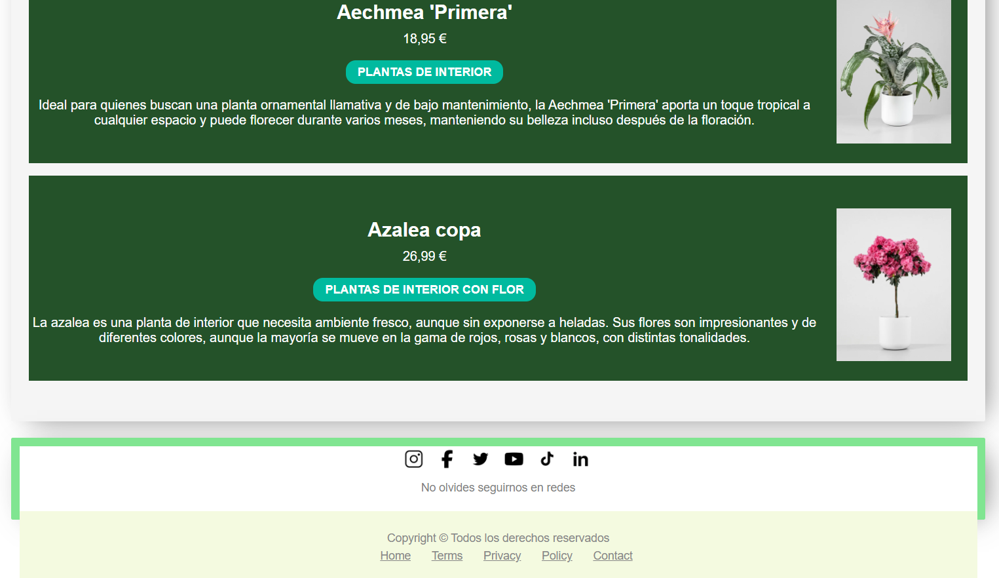
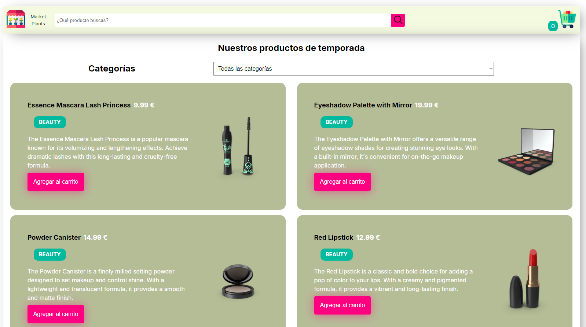
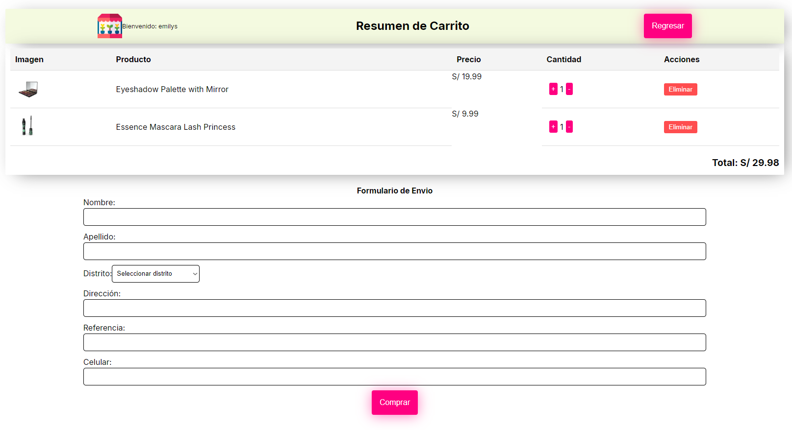
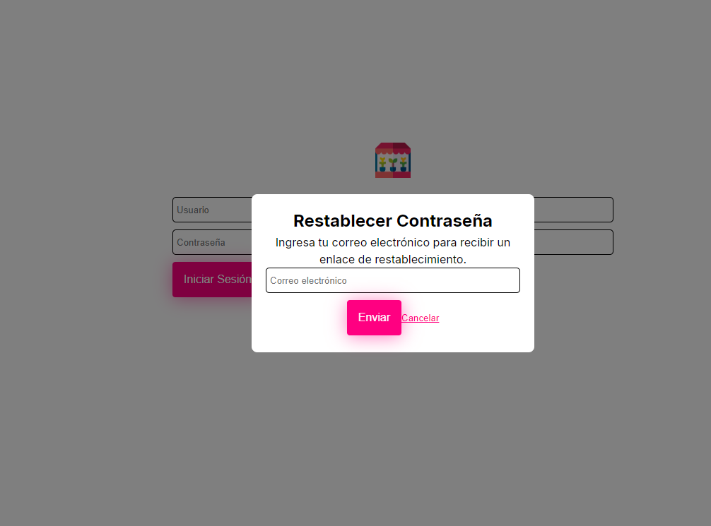
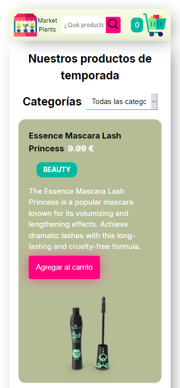
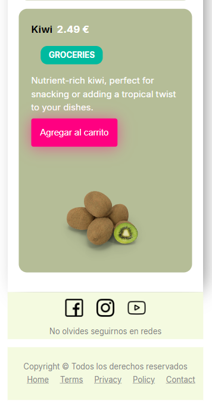
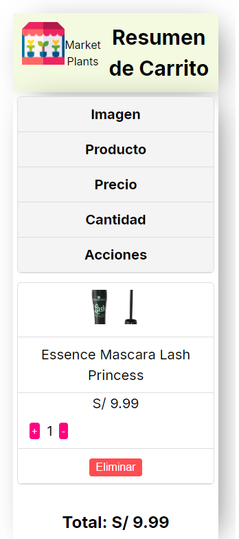
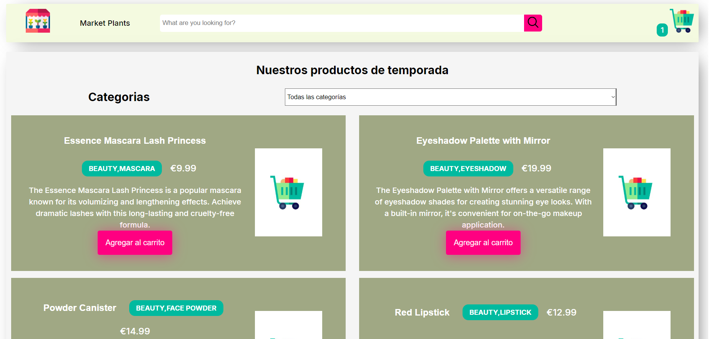
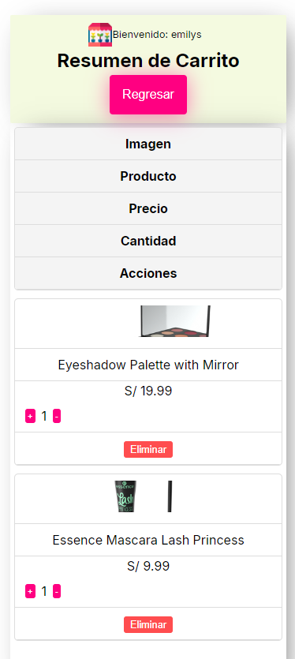

 

# 🌱 Market PLants - Web de productos



Market Plants es una aplicación web que permite a los usuarios explorar, buscar y comprar productos de plantas organizados por categorías, con opciones de búsqueda dinámica en tiempo real.

## 📒 Index

1. [About](#about)
2. [Usage](#usage)
3. [Installation](#installation)
4. [Commands](#commands)
5. [Development](#development)
6. [Build](#build)
7. [Gallery](#gallery)

---

## About

**Market Plants** es una aplicación basada en React con funciones dinámicas de filtrado, búsqueda y selección de categorías para una experiencia de usuario perfecta. Incluye:

- Funcionalidad de barra de búsqueda en tiempo real.
- Filtrado de productos por categoría.
- Diseñado con Styled-Components para una apariencia moderna.
- API de contexto para administrar el carrito de compras.

---

## Usage

Explora la lista de productos, busca productos de forma dinámica y fíltralos por categoría mediante el menú desplegable. Agrega productos a tu carrito y disfruta de una gestión de estado fluida en toda la aplicación.

Para ingreso al resumen de pago las credenciales en prueba local son:
usuario: emilys
contraseña: emilyspass

## Installation

1. Clonar el repositorio:
   ```bash
   git clone https://github.com/MilagrosRn/BOOTCAMP-FRONTEND-REACT-NTT.git
   ```
2. Navegar al folder del proyecto
   ```bash
   cd market-plants
   ```
3. Instalar dependencias
   ```bash
   npm install
   ```

## Commands

| Comando       | Descripcion                           |
| ------------- | ------------------------------------- |
| npm start     | Lanza el servidor de desarrollo       |
| npm run build | Construye el proyecto para producción |

## Development

- Node.js (>= 16.x)
- npm (>= 8.x)

Estructura de archivos

```
   /src
   /components
       /Header
       /Footer
       /ProductList
       /Form
       /FormField
       /Modal
       /ShoppingCar
   /context
       cartContext.tsx
       useCart.ts
   /routes
   /services
   /data
      districts.json
   /hooks
   /pages
      /home
      /resume
   /domain
       products.ts
       categoryItem.ts
   /shared
       helpers/
       util/
   App.tsx
   index.tsx
```

## Build

Generar una carpeta build donde estara la version de producción
```
   npm run build
```

## Gallery

### web






### movil





