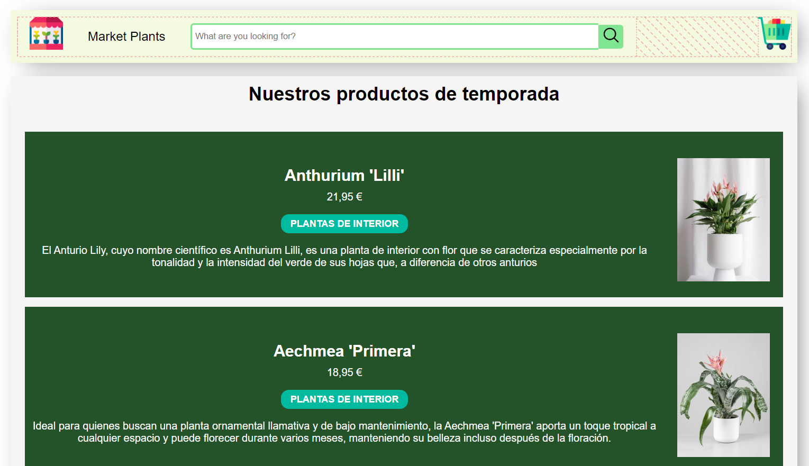

# 🌱 Tienda de Plantas - Web Básica

¡Bienvenido/a a la Tienda de Plantas en Línea! Este proyecto es una página web sencilla desarrollada con HTML y CSS que permite a los usuarios explorar y adquirir diferentes tipos de plantas. Es un sitio ideal para los amantes de la jardinería que buscan encontrar plantas para su hogar o jardín.

## 📋 Descripción

La Tienda de Plantas es una web básica que presenta una interfaz amigable y fácil de navegar para los usuarios que desean comprar plantas. Este proyecto se centra en el diseño sencillo y funcional utilizando HTML y CSS, y se enfoca en la presentación visual de los productos y una navegación simple.

### Características

- Página de inicio con una descripción general de la tienda.
- Catálogo de plantas con imágenes y breves descripciones de cada tipo de planta.
- Sección de categorías para facilitar la búsqueda de plantas específicas (e.g., suculentas, plantas de interior, plantas de exterior).
- Información para que los usuarios puedan hacer consultas o recibir asistencia.
- Diseño adaptable a dispositivos móviles para facilitar el acceso desde cualquier dispositivo.

## 📂 Estructura del Proyecto

La estructura de archivos de este proyecto es la siguiente:


```
prototipo-esperado-entrega/
├── index.html            # Página principal
├── style.css         # Estilos de la web
└── img/          # Carpeta con imágenes de las plantas e iconos
```

En el repositorio se encontraran otras carpetas desarrolladas en las sesiones teoricas en las que se baso el proyecto

## 🚀 Tecnologías Utilizadas

- **HTML5**: Para estructurar el contenido de la página.
- **CSS3**: Para diseñar y estilizar la apariencia de la web.

## 📸 Capturas de Pantalla
### movil


### web



## 📄 Licencia

Este proyecto se distribuye bajo la Licencia MIT, lo que significa que puedes usarlo, modificarlo y distribuirlo libremente.

---
