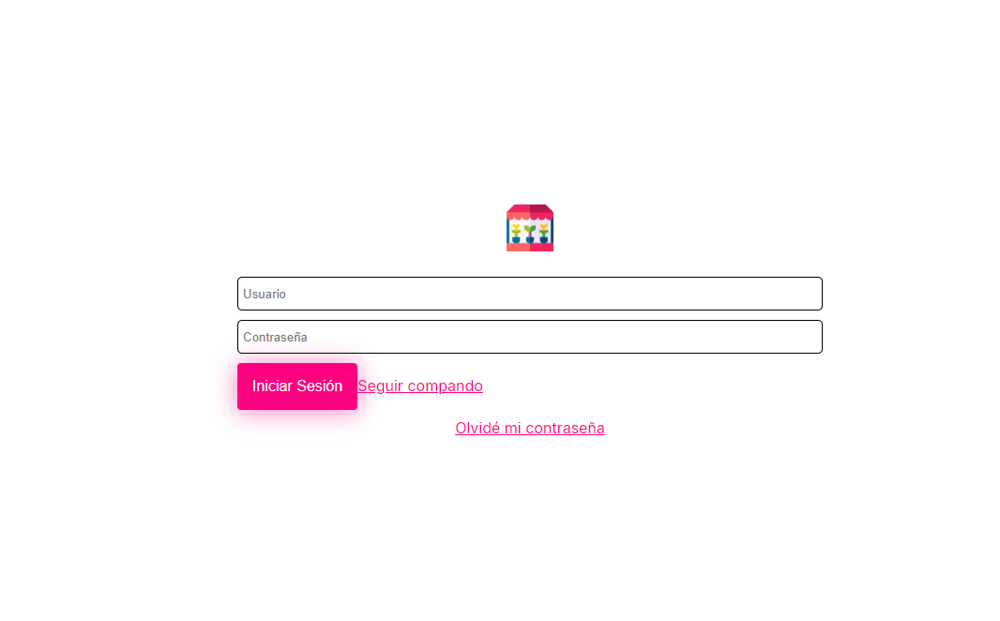

# 🌱 Market PLants - Web de productos

¡Bienvenido/a a la Tienda en Línea! Este proyecto es una página web sencilla desarrollada con HTML y CSS que permite a los usuarios explorar y adquirir diferentes tipos de productos.

## 📋 Descripción

La Tienda de Plantas es una web básica que presenta una interfaz amigable y fácil de navegar para los usuarios que desean comprar productos categorizados en belleza,fragancias,muebleria y abarrotes.

### Características

- Página de inicio con una descripción general de la tienda.
- Catálogo con imágenes y breves descripciones de cada tipo de producto.
- Sección de categorías para facilitar la búsqueda
- Barra de busqueda de productos reactiva
- Diseño adaptable a dispositivos móviles para facilitar el acceso desde cualquier dispositivo.

## 📂 Estructura del Proyecto

La estructura de archivos de este proyecto es la siguiente:


```
market-proyect/
├── index.html            # Página principal
├── style.css         # Estilos de la web
├── main.js         # Logica centralizada en llamadas modularizadas entre archivos JS
└── assets/          # Carpeta con imágenes de las plantas e iconos
└── scripts/          # Carpeta con archivos JS modularizando la logica del codigo
```

En el repositorio se encontraran otras carpetas desarrolladas en las sesiones teoricas en las que se baso el proyecto

## 🚀 Tecnologías Utilizadas

- **HTML5**: Para estructurar el contenido de la página.
- **CSS3**: Para diseñar y estilizar la apariencia de la web.

## 📸 Capturas de Pantalla
### movil


### web


## 📄 Licencia

Este proyecto se distribuye bajo la Licencia MIT, lo que significa que puedes usarlo, modificarlo y distribuirlo libremente.

---
